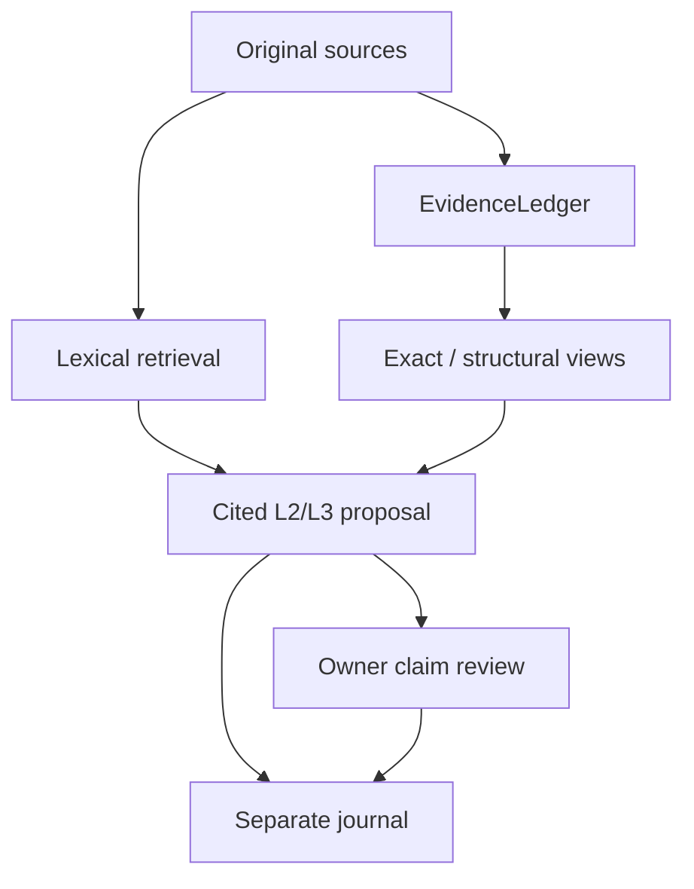

> Русская установка: [INSTALL_RU.md](./INSTALL_RU.md)

# FVSC — source-cited personal semantics

FVSC keeps original personal sources and their provenance as the ground truth, then
builds cheap, replaceable structures for retrieval, explanation, temporal comparison,
and optional interpretation.

The active implementation is under `src/fvsc/`. The older `core/` and root `service/`
trees remain as a research record; clean code is forbidden from importing them.

## What works now

- Obsidian Markdown and Telegram JSON become revisioned `SourceDocument` records.
- `EvidenceLedger` preserves append-only assertion/retraction history.
- Source replacement, deletion, reactivation, replies, forwards, temporal context,
  authorship, locators, and deferred media retain provenance.
- A Unicode character n-gram index searches current original text without persisting a
  raw-text index.
- A lightweight `pymorphy3` adapter proposes exact Russian S→V→O/adjective relations,
  all marked defeasible and source-spanned.
- Owner feedback, temporal contradiction views, interpretation-layer policies, and an
  open-meaning private gold contract are implemented.
- Ollama can produce structured L3 claims. Every supported claim must cite transient
  `S1…Sn` sources that FVSC resolves into revision/hash citations.
- Proposals and claim-level owner assessments are stored outside canonical evidence in
  `.fvsc/interpretations.json`.
- FastAPI and the Obsidian plugin are thin clients over these contracts.

## Epistemic boundary



An Antourage answer is not owner evidence. Accepting/rejecting a claim records review
metadata but does not rewrite its source or silently insert model text into the ledger.

## Honest real-data result

On private owner-reviewed Gold 001–015 (`k=10`):

| Retriever | MRR | Mean recall | Context recall | Negative hits |
|---|---:|---:|---:|---:|
| Lexical character n-grams | **0.5262** | **0.6389** | **0.3333** | 0 |
| Exact Judgment | 0.2611 | 0.3778 | 0.1667 | 0 |
| Equal RRF | 0.4000 | 0.4000 | 0.3333 | 0 |
| Lexical 5:1 RRF | 0.3950 | 0.5389 | 0.3333 | 0 |

Lexical retrieval remains the default. Exact relations are useful for provenance,
explanation, feedback, and temporal structure, but semantic superiority has not been
demonstrated. Density and ContainerCore remain optional experimental views.

## Quick start

```bash
python -m venv .venv
source .venv/bin/activate
pip install -r requirements.txt

# Build/update a local append-only vault cache with exact Russian proposals.
PYTHONPATH=src python -m fvsc.ingest.vault_sync \
  --vault "/path/to/vault" --exact-judgments

# Start the local API (bind loopback only).
FVSC_VAULT_PATH="/path/to/vault" \
FVSC_LLM_MODEL="qwen2.5:14b-instruct-q4_K_M" \
python -m uvicorn fvsc.service.app:app --app-dir src \
  --host 127.0.0.1 --port 8765
```

Useful endpoints:

| Route | Purpose |
|---|---|
| `GET /health` | local configuration/load health |
| `GET /v1/status` | source, ledger, exact, feedback, snapshot counts |
| `POST /v1/vault/sync` | scan and reconcile the complete vault |
| `POST /v1/search` | lexical original-source search |
| `GET /v1/source` | revision-checked current source body |
| `POST /v1/feedback` | append-only evidence feedback |
| `GET /v1/interpretation/status` | Ollama/model availability |
| `POST /v1/interpret` | source-cited defeasible interpretation |
| `POST /v1/interpret/assess` | claim-level owner review |

## Obsidian plugin

```bash
cd obsidian-plugin
npm install
npm run build
```

Copy `main.js`, `manifest.json`, and `styles.css` into
`<vault>/.obsidian/plugins/fvsc-antourage/`, enable the plugin, and configure Python / FVSC
paths if autodetection does not find them. The plugin launches the clean service,
debounces vault changes into atomic reconciliation, searches original notes, opens cited
Markdown, calls local Ollama, and records accept/reject decisions per claim.

## Verification

```bash
PYTHONPATH=src python -m pytest -q
PYTHONPATH=src python scripts/check_no_legacy_imports.py
cd obsidian-plugin && npm run build
```

Current local checkpoint: **229 passed, 2 skipped, 11 deselected**; boundary check and
production plugin build green. See
[project status](./docs/status/PROJECT_STATUS.md) and
[Stage 4f/4g architecture](./docs/architecture/STAGE_4F_CITED_INTERPRETATION_AND_TRANSPORTS.md).

## Active package layout

| Path | Responsibility |
|---|---|
| `src/fvsc/evidence/` | canonical events, ledger, policy, feedback, timelines |
| `src/fvsc/ingest/` | source adapters, lifecycle, exact/co-occurrence extraction |
| `src/fvsc/retrieval/` | lexical floor, exact lookup, experimental fusion |
| `src/fvsc/interpretation/` | cited proposals, assessment, local journal |
| `src/fvsc/evaluation/` | open gold mechanics and metrics |
| `src/fvsc/runtime/` | deterministic materialization and atomic cache |
| `src/fvsc/integrations/ollama.py` | strict loopback structured L3 backend |
| `src/fvsc/service/` | vault application runtime and thin FastAPI routes |
| `obsidian-plugin/` | local native client |

## Author

Created by **Rein**, with AI-assisted research and implementation.
