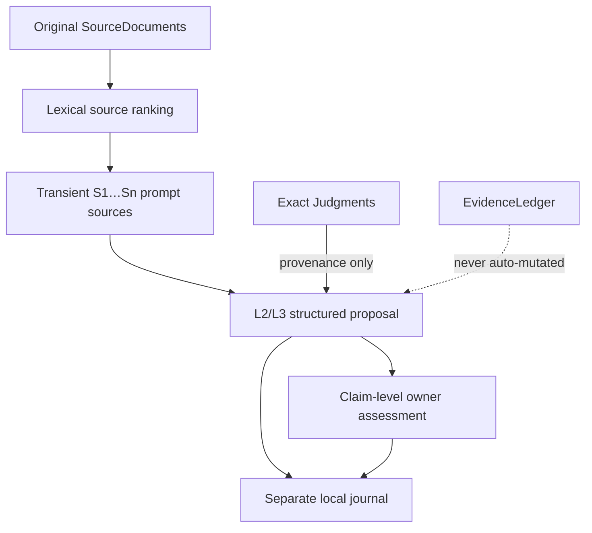

# Stage 4f/4g — cited interpretation and thin transports

**Status:** implemented locally on `integration/fvsc-core-v1` (2026-07-14).
Remote CI covers the previous pushed checkpoint `cc1a6ae`; the current local
checkpoint requires explicit push authorization before GitHub can test it.

## Purpose

This stage restores the usable Antourage interpretation path, FastAPI, Ollama, and
Obsidian without restoring the legacy mistake of treating a generated map or LLM
answer as canonical memory. It is an incremental layer over Stage 4d/4e; the broader
research-agent suite remains outside this stage:

The lexical baseline determines source order. Exact Judgments can add event ids to
citations, but cannot rerank sources. This preserves the private Gold 001–015 result:
lexical MRR@10 is 0.5262, exact MRR@10 is 0.2611, and neither tested fusion is
promoted.

## Restored contracts

### Source-cited proposals

- `SourceCitation` binds a source id, source revision, half-open character range,
  text SHA-256, and optional exact evidence-event ids.
- Every generated answer is split into independently reviewable claims.
- A claim is explicitly `evidence_bound`, `partially_supported`, or
  `free_generation`.
- L2/L3 proposals are always defeasible and are not `EvidenceEvent` objects.
- Backend-visible labels are transient (`S1`, `S2`, ...). A model cannot invent a
  persisted source id; FVSC resolves valid labels after generation.

### Gold and owner review

- Proposal evaluation measures citation precision/recall, negative-source hits,
  unsupported claims, and forbidden `separate` composites.
- Character n-gram similarity to the owner's free interpretation is only a surface
  diagnostic, never a semantic truth score.
- Owner review accepts/rejects claims individually and supports accepted, partial,
  rejected, and needs-revision verdicts.
- Proposals and assessments are stored in an atomic, content-validated local journal
  under `.fvsc/interpretations.json`; original source text is not copied there.
- An assessment does not silently promote model text into EvidenceLedger.

### Local service

`fvsc.service.app` exposes thin routes over `VaultRuntime`:

| Route | Contract |
|---|---|
| `GET /health` | configuration/load health without exposing absolute vault paths |
| `GET /v1/status` | source, ledger, exact, feedback, and snapshot counts |
| `POST /v1/vault/sync` | complete source scan and append-only lifecycle reconcile |
| `POST /v1/search` | lexical source ranking; semantic reranking explicitly false |
| `GET /v1/source` | current text only when the requested revision still matches |
| `POST /v1/feedback` | append-only feedback over an evidence event |
| `GET /v1/interpretation/status` | local backend/model availability |
| `POST /v1/interpret` | lexical retrieval followed by a cited proposal |
| `POST /v1/interpret/assess` | persist a claim-level owner decision |

`VaultRuntime` refuses to pair changed source text with a stale cache. Feedback is
written through a trial ledger, re-materialized, atomically saved, and only then made
live in memory.

### Ollama and Obsidian

- Ollama is restricted to an explicit loopback origin and bypasses proxy variables.
- Prompts and responses have hard size limits; responses must match a strict JSON
  claim schema. Transport/schema errors do not echo source text.
- The Obsidian plugin now launches `fvsc.service.app`, reconciles vault changes through
  `/v1/vault/sync`, and no longer posts raw note bodies to a legacy mutation route.
- Its native view exposes lexical sources, cited interpretations, source-note links,
  support levels, and claim-level review. The normal Obsidian graph remains available.

## Verification

- Python: **229 passed / 2 skipped / 11 deselected**.
- Legacy boundary: green (`src/fvsc` imports no legacy modules).
- Obsidian production TypeScript build: green.
- Private Gold 001–015 rerun: identical accepted decision — lexical remains default,
  no semantic/hybrid arm promoted, zero negative hits.
- Remote `main` remains `ff703b7`; no PR was merged.

One local skip is the FastAPI `TestClient` suite because this execution image lacks
FastAPI even though it is declared in `requirements.txt`; schemas, application runtime,
route module compilation, and all dependency-free transport logic were exercised.

## Remaining falsifiable work

1. Run the actual configured Ollama model across Gold 001–015 and collect owner
   claim-level verdicts. Source retrieval success is not interpretation success.
2. Measure meaning fidelity, forbidden composites, citation quality, latency, and
   abstention before making any Antourage superiority claim.
3. Replace the plugin's debounced full-vault reconcile with a source-scoped reconcile
   only if profiling shows a real latency problem; the API contract need not change.
4. Keep graph, ContainerCore, and density available as experimental views. Port a view
   only when it improves a registered owner task, not merely because it looks richer.
